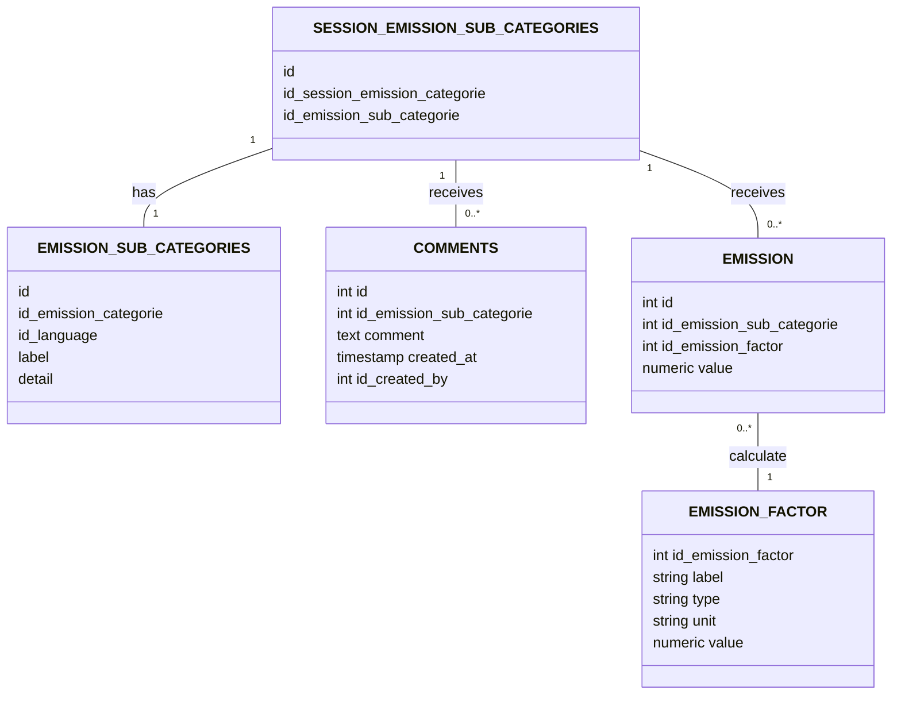

```mermaid
classDiagram

    class EMISSION_SUB_CATEGORIES {
        id
        id_emission_categorie
        id_language
        label
        detail
    }
    class SESSION_EMISSION_SUB_CATEGORIES {
        id
        id_session_emission_categorie
        id_emission_sub_categorie
    }

    class COMMENTS {
        int id
        int id_emission_sub_categorie
        text comment
        timestamp created_at
        int id_created_by
    }

    class EMISSION {
        int id
        int id_emission_sub_categorie
        int id_emission_factor
        numeric value
    }

    class EMISSION_FACTOR {
        int id_emission_factor
        string label
        string type
        string unit
        numeric value
    }

    SESSION_EMISSION_SUB_CATEGORIES "1" -- "0..*" COMMENTS : receives
    SESSION_EMISSION_SUB_CATEGORIES "1" -- "0..*" EMISSION : receives
    EMISSION "0..*" -- "1" EMISSION_FACTOR : calculate
    SESSION_EMISSION_SUB_CATEGORIES "1" -- "1" EMISSION_SUB_CATEGORIES : has
```
